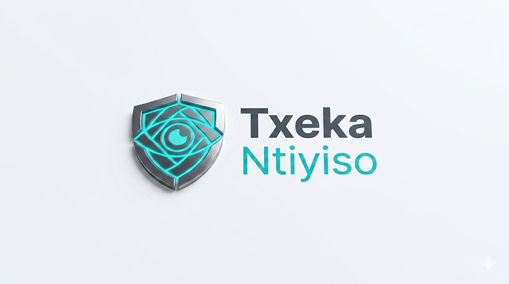

<p align="center">
  
</p>

<h1 align="center">Txeka Ntiyiso</h1>

<p align="center">
  <strong>Infraestrutura tecnológica para verificação da integridade e autenticidade documental em Moçambique</strong>
</p>

<p align="center">
  <a href="https://txeka-ntiyiso-api.onrender.com/health">
    
  </a>
  
  
  
  
  <br/>
  
  
  
  
</p>

---

## ⚡ Em 30 Segundos

O **Txeka Ntiyiso** transforma processos de validação manuais — que demoram dias, exigem deslocações e custam milhares de Meticais — em **auditorias digitais instantâneas de menos de 100 milissegundos**.

A digitalização dos serviços públicos e privados em Moçambique aumenta a necessidade de mecanismos confiáveis para verificar documentos eletrónicos. O Txeka Ntiyiso responde a este desafio oferecendo uma infraestrutura de verificação baseada em criptografia, preparada para integração entre instituições.

> **Como funciona:** A instituição emite o documento ➡️ o sistema gera uma **impressão digital criptográfica (hash SHA-256)** + um **QR code** verificável ➡️ qualquer parceiro ou cidadão aponta a câmara e confirma na hora se o documento é autêntico.

---

## Missão, Visão e Princípios

**Missão:** Fortalecer a confiança nas transações documentais através de uma infraestrutura digital segura, interoperável e alinhada com a legislação moçambicana.

**Visão:** Tornar-se a infraestrutura nacional de referência para verificação da integridade documental em Moçambique.

| Princípio | Descrição |
|-----------|-----------|
| **Integridade** | Garantia de que o documento não foi alterado desde a emissão |
| **Autenticidade** | Confirmação da origem e legitimidade do documento |
| **Rastreabilidade** | Trilha de auditoria completa de todas as operações |
| **Privacidade por Design** | O PDF é processado em memória para calcular o hash SHA-256 e é descartado de imediato. Não retemos o ficheiro original. |
| **Interoperabilidade** | API REST padronizada para integração com sistemas existentes |
| **Auditabilidade** | Logs imutáveis acessíveis para auditorias internas e externas |
| **Segurança por Defeito** | Configurações seguras por padrão, sem necessidade de ajustes manuais |

---

## 🎯 Quem Ganha com o Txeka Ntiyiso?

### 🏛️ Instituições Públicas (B2G)
*Para o INAGE, Ministérios, Tribunais e Autarquias*

- **Validação Interinstitucional:** Verifique certidões, DUATs e alvarás emitidos por outros órgãos do Estado num piscar de olhos.
- **Fim das Filas:** Elimine a necessidade de o cidadão deslocar-se fisicamente apenas para "autenticar cópias".
- **Transparência Radical:** Trilha de auditoria criptográfica e imutável, pronta para auditorias do Tribunal de Contas.

🚀 **[Lidere a Modernização Administrativa ➡️ Agende uma Demo](mailto:geral.txekantiyiso@gmail.com)**

### 💼 Empresas e Banca (B2B)
*Para KYC, Onboarding de Clientes e Compliance Financeiro*

- **Mitigação da fraude documental:** Detete instantaneamente relatórios financeiros, cartas de referência ou diplomas adulterados.
- **Integração Relâmpago:** API REST robusta, documentada e pronta para entrar em produção em menos de 24 horas.
- **Soberania de Dados:** Reduza a dependência de plataformas estrangeiras caras e fature tudo na moeda local.

🔌 **[Explore a Documentação da API ➡️ Ver API Reference](doc/guides/API_REFERENCE.md)**

---

## 🔥 Porquê o Txeka Ntiyiso?

**O Cenário Atual:** Certificados académicos falsos, alvarás e DUATs adulterados, verificação manual que consome semanas, e plataformas externas que cobram em Dólares/Euros retendo dados confidenciais do país.

**A Nossa Solução:**
- **Criptografia SHA-256:** Algoritmo criptográfico amplamente adotado na indústria. Qualquer alteração ao ficheiro original modifica completamente o hash, tornando a adulteração imediatamente detetável.
- **Velocidade Extrema:** Desempenho típico inferior a 100 ms em ambiente de produção.
- **Soberania Nacional:** Custos fixos em Meticais e total respeito pelo sigilo de dados do Estado.
- **Rasto de auditoria:** Hashes e logs imutáveis conservados para verificação; o PDF original não é retido (não somos Entidade Certificadora).

---

## 🛡️ Privacidade por Design

O Txeka Ntiyiso calcula o hash SHA-256 **no servidor**, em memória. O PDF é enviado na emissão (`POST /api/v1/certify`), validado, hashed e **descartado de imediato**. O ficheiro original **não é gravado** na base de dados nem em disco.

1. A instituição anexa o PDF no portal (ou envia via API).
2. A API valida o ficheiro (extensão `.pdf`, MIME `application/pdf`, magic bytes `%PDF-`).
3. O hash SHA-256 é calculado em memória a partir dos bytes do PDF.
4. Persistimos o hash (64 caracteres) e metadados operacionais — não o conteúdo do PDF.
5. O documento original é descartado após o cálculo do hash.

**Resultado:** minimização de dados por construção — o servidor precisa do PDF para emitir, mas não o retém.

---

## ⚖️ Declaração de Posição Regulatória

O **Txeka Ntiyiso** é uma infraestrutura tecnológica de **verificação de integridade documental e evidência operacional**. Utiliza **SHA-256** e **QR codes** para comprovar correspondência criptográfica com um registo previamente criado.

> **Declaração Regulatória:** O Txeka Ntiyiso **não se enquadra como Entidade Certificadora** nos termos da Lei n.º 3/2017 (Arts. 54.º–57.º e 59.º) nem substitui o SCDM (Decreto n.º 59/2019). Não emite certificados digitais, chaves privadas, assinaturas digitais nem carimbos de tempo qualificados. A verificação comprova correspondência criptográfica com o registo Txeka; **não constitui certificado digital emitido pelo SCDM**.

---

## 🏗️ Arquitetura e Pipeline

```
  PDF / Documento Original
           |
           v
   +---------------+
   |  Upload PDF   |  <- Ficheiro em trânsito (HTTPS)
   |   (portal)    |
   +-------+-------+
           |  PDF (multipart)
           v
   +---------------+
   |  API REST     |  <- Hash SHA-256 em memória; PDF descartado
   |  Txeka Ntiyiso|     Prefixo: /api/v1
   +-------+-------+
           |
     +-----+-----+
     |           |
     v           v
+---------+  +--------------+
|PostgreSQL|  |  Audit Logs  |  <- Rasto de auditoria operacional
|  15     |  |   Imutáveis  |
+----+----+  +--------------+
     |
     v
+-------------+
|  QR Code    |  <- Verificável por qualquer cidadão via telemóvel
| Verificável |
+------+------+
       |
       v
+-----------------+
| Verificação     |  <- Pública, anónima, < 100 ms
| Pública / API   |
+-----------------+
```

| Camada | Tecnologia | Função |
|--------|-----------|--------|
| Backend | FastAPI 0.110 + Python 3.11 | API REST, lógica de negócio, autenticação JWT |
| Base de Dados | PostgreSQL 15 | Persistência ACID de hashes, metadados e audit logs |
| Frontend | React + Tailwind CSS | Portal de verificação, dashboard institucional |
| Segurança | JWT + bcrypt + Rate Limiting | Autenticação stateless, proteção contra abuso |
| Deploy | Render.com (Produção) / Docker (Local & On-premise) | Cloud imediata; on-premise para soberania digital |

**Produção Atual:** [API](https://txeka-ntiyiso-api.onrender.com) · [Health](https://txeka-ntiyiso-api.onrender.com/health) · [Swagger](https://txeka-ntiyiso-api.onrender.com/docs) · Último deploy: 22/07/2026

**Ambiente Local:** Docker + docker-compose com PostgreSQL 15, pronto para `docker-compose up`.

**Futuro:** Migração para infraestrutura nacional (Docker on-premise) para soberania digital, alinhamento com o Artigo 71.º da Constituição e resiliência independente de conectividade internacional.

---

## Estado Atual e Roadmap

| Fase | Período | Estado | Entregáveis |
|------|---------|--------|-------------|
| **Fase 1** | Q1 2026 | ✅ Concluída | MVP core: emissão, verificação, revogação, audit logs imutáveis |
| **Fase 2** | Q2–Q3 2026 | 🔄 **Em curso** | Registo de Instituições + Dashboard Web + Emissão em Bulk + Controlo de Créditos |
| **Fase 3** | Q3 2026 | ⏳ Planeada | Queries agregadas `/stats` + Go-to-market com INAGE e bancos |
| **Fase 4** | Q4 2026 | ⏳ Planeada | Dashboard por perfil + Escala empresarial: 2FA, OAuth2, ML fraud detection |

> **Fase 2 — Operacional agora:** Registo de instituições com API key, login dual (Admin/Institution), emissão única e em bulk, verificação pública anónima, audit logs, validação rigorosa de PDF e arquitetura multi-tenant.

---

## Como Começar

### Para Desenvolvedores

```bash
git clone https://github.com/achrafismaelismael823-glitch/Txeka-Ntiyiso.git
cd Txeka-Ntiyiso

# Opção 1: Docker (Recomendado)
docker-compose up --build

# Opção 2: Python local
cd api-gateway
python -m venv .venv && source .venv/bin/activate
pip install -r requirements.txt
# ou: poetry install
uvicorn src.main:app --reload
```

Aceda a `http://localhost:8000/docs` para a documentação Swagger interativa.

### Para Instituições (Fase 2 — Lista de Espera)

Contacte: **geral.txekantiyiso@gmail.com**

- **Demo estratégica** (15 minutos) · **Piloto operacional** (15 dias, sem custo) · **Integração API** com suporte técnico dedicado · **Suporte 24/7**

> Nota: O registo de novas instituições está a ser feito manualmente durante a Fase 2. Em breve, o processo será automatizado via portal de administração.

---

## Endpoints da API

> **Base URL:** `https://txeka-ntiyiso-api.onrender.com`  
> **Prefixo:** `/api/v1` (configurado em `main.py` via `API_V1_STR`)  
> **Documentação interativa:** `/docs` (Swagger UI) · `/redoc` (ReDoc)

| Categoria | Método | Endpoint | Descrição | Acesso |
|-----------|--------|----------|-----------|--------|
| Auth | `POST` | `/api/v1/admin/login` | Login administrador (token 90 dias) | Público |
| Auth | `POST` | `/api/v1/login` | Login instituição (token 30 dias) | Público |
| Emissão | `POST` | `/api/v1/certify` | Emitir documento único (PDF) | Institution |
| Emissão | `POST` | `/api/v1/certify/bulk` | Emitir múltiplos documentos em lote | Institution |
| Verificação | `GET` | `/api/v1/verify/{doc_hash}` | Verificar documento por hash (público) | Público |
| Verificação | `POST` | `/api/v1/verify` | Verificar documento por hash (B2B/B2G) | Público |
| Dashboard | `GET` | `/api/v1/me/dashboard` | Dashboard da instituição autenticada | Institution |
| Dashboard | `GET` | `/api/v1/me/credits` | Créditos disponíveis e status | Institution |
| Dashboard | `GET` | `/api/v1/me/credit-history` | Histórico de transações de crédito | Institution |
| Admin | `POST` | `/api/v1/emissions/{doc_id}/revoke` | Revogar documento (invalidação legal) | Admin |
| Admin | `GET` | `/api/v1/logs` | Logs de auditoria imutáveis | Admin |
| Admin | `GET` | `/api/v1/document/{doc_hash}/history` | Rasto cronológico do documento | Admin / Institution |
| Admin | `GET` | `/api/v1/stats` | Métricas e volume de validações | Admin |
| Admin | `POST` | `/api/v1/{institution_id}` | Criar nova instituição | Admin |
| Admin | `GET` | `/api/v1/{institution_id}` | Detalhes da instituição | Admin |
| Admin | `PATCH` | `/api/v1/{institution_id}` | Atualizar instituição | Admin |
| Admin | `POST` | `/api/v1/{institution_id}/credits` | Adicionar créditos à instituição | Admin |
| Admin | `GET` | `/api/v1/{institution_id}/credit-history` | Histórico de créditos da instituição | Admin |
| Admin | `POST` | `/api/v1/{institution_id}/reset-password` | Reset de password da instituição | Admin |
| Admin | `POST` | `/api/v1/{institution_id}/regenerate-api-key` | Regenerar API key da instituição | Admin |

> Para especificações detalhadas (request/response, schemas, códigos de erro), consulte a [Referência da API](doc/guides/API_REFERENCE.md).

---

## Índice de Documentação Interna

Para especificações detalhadas, manuais operacionais e documentação técnica completa, consulte a estrutura em `doc/`:

- **Desenvolvimento & Integração:** [Referência da API](doc/guides/API_REFERENCE.md) · [Arquitetura Técnica](doc/technical/TECHNICAL.md)
- **Operações Institucionais:** [Manual do Utilizador](doc/guides/USER_GUIDE.md) · [Estratégia de Implantação](doc/technical/DEPLOYMENT.md)
- **Jurídico & Compliance:** [Dossiê de Conformidade Legal](doc/legal/COMPLIANCE.md) · [Declaração de Posicionamento](POSITIONING.md)
- **Segurança & DevOps:** [Runbook de Produção](doc/technical/RUNBOOK.md) · [Políticas de Segurança Cibernética](doc/legal/SECURITY.md)

---

## Conformidade Legal e Retenção de Dados

O Txeka Ntiyiso foi concebido em conformidade com os princípios e requisitos aplicáveis da legislação moçambicana relativos à integridade, autenticidade e rastreabilidade documental.

| Legislação | Âmbito | Alinhamento |
|------------|--------|-------------|
| Lei n.º 3/2017 | Transações Eletrónicas de Moçambique | Integridade via SHA-256; evidência operacional. Não é Entidade Certificadora (Arts. 54.º–57.º e 59.º) |
| Decreto n.º 59/2019 | Sistema de Certificação Digital (SCDM) | Delimitação: o Txeka Ntiyiso não pertence ao SCDM; a verificação não é certificado digital |

- **Proteção de Dados:** Artigo 71.º da Constituição e Privacidade por Design — o PDF é processado em memória e descartado. Tratamos dados operacionais (email, IP, actor) nos termos dos Arts. 63.º–65.º da Lei n.º 3/2017.
- **Retenção:** Hashes e logs conservados por política operacional (finalidade/necessidade). Não existe prazo legal de 20 anos aplicável ao Txeka Ntiyiso.

---

## 📊 Números Que Falam Por Si

| Métrica | Valor |
|---------|-------|
| ⏱️ Tempo de Validação | Desempenho típico < 100 ms em produção |
| 🛡️ Algoritmo Core | SHA-256 Criptográfico |
| 💾 PDF original persistido | Não (descartado após o hash) |
| ⏳ Retenção de Trilha | Política operacional (a formalizar) |
| 🌍 Cobertura Regional | Pronto para escala imediata em Maputo, Beira, Nampula e resto do país |

---

## Stack Tecnológica

| Componente | Tecnologia | Versão |
|------------|-----------|--------|
| Linguagem | Python | 3.11 |
| Framework | FastAPI | 0.110.0 |
| Servidor | Uvicorn | 0.28.0 |
| ORM | SQLAlchemy | 2.0.29 |
| Migrations | Alembic | 1.12.1 |
| Base de Dados | PostgreSQL | 15 |
| Driver Async | asyncpg | 0.29.0 |
| Driver Sync | psycopg2-binary | 2.9.9 |
| Hashing | bcrypt | 5.0.0 |
| JWT | python-jose + PyJWT | 3.5.0 / 2.8.0 |
| Rate Limiting | slowapi + limits | 0.1.9 / 3.8.0 |
| Logging | structlog | 24.1.0 |
| QR Code | qrcode + Pillow | 7.4.2 / 11.0.0 |
| PDF | PyPDF2 | 3.0.1 |
| Config | pydantic-settings | 2.2.1 |
| Deploy | Render + Docker | — |
| CI/CD | GitHub Actions | — |

---

## Suporte e Contacto

- **Email:** geral.txekantiyiso@gmail.com
- 🌍 **Website:** (Brevemente em txeka-ntiyiso.co.mz)
- **GitHub Issues:** [github.com/achrafismaelismael823-glitch/Txeka-Ntiyiso/issues](https://github.com/achrafismaelismael823-glitch/Txeka-Ntiyiso/issues)
- **Status do Sistema:** [https://txeka-ntiyiso-api.onrender.com/health](https://txeka-ntiyiso-api.onrender.com/health)

---

Txeka Ntiyiso — Orgulhosamente desenvolvido em Moçambique 🇲🇿 para proteger o futuro digital da nossa nação.

Proprietary. All rights reserved. Txeka Ntiyiso, 2026.
